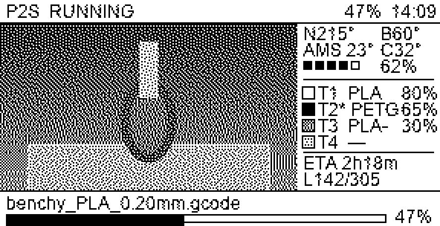
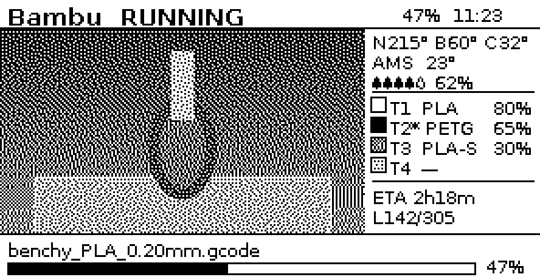

# Quote Bambu

English | [简体中文](README.md)

Push live Bambu Lab printer status to a Quote/0 e-paper display. Quote Bambu
reads local-LAN MQTT telemetry, optionally captures a camera frame, and runs as
a single Docker container.

> **Unofficial community project.** Quote Bambu is not affiliated with or
> endorsed by Bambu Lab or MindReset/Dot.



<sub>Camera layout in the default Canvas mode. The Image mode preview appears
below.</sub>

## Compatibility

The intended compatibility targets are P2S (the primary development baseline),
P1P / P1S, A1 / A1 mini, X1 / X1C / X1E, and H2D / H2DPro.

RTSPS, normally used by P2S / X1 / H2 printers, and the port 6000 JPEG stream,
normally used by P1 / A1 printers, can be detected automatically. Bambu LAN,
camera, and Developer Mode behavior can change by model, firmware, and security
mode. Not every model/firmware combination has been verified, and compatibility
is not guaranteed. Compatibility reports that include the printer model,
firmware version, and redacted logs are welcome.

## Features

- Subscribes to local printer MQTT telemetry and requests one `pushall` status
  refresh after connecting. It does not send printer-control commands.
- Captures RTSPS or JPEG camera frames, crops them to 16:9, and converts them to
  the project's 1-bit output with Floyd-Steinberg dithering.
- Shows printer state, progress, clock, nozzle/bed/chamber temperatures, AMS
  humidity and temperature, four filament trays, ETA, layer count, and job
  name.
- Switches to a full-screen alert when Bambu HMS errors are present. English
  HMS descriptions are downloaded from Bambu's public endpoint at startup,
  with a temporary local cache as fallback.
- Falls back to a data-only layout when the camera is disabled or unavailable.
- Supports Quote/0 Canvas API and Image API output.

## Canvas and Image modes

Set `PUSH_MODE` to choose how the same printer data is rendered:

| Mode | Quote/0 API | Rendering |
|---|---|---|
| `canvas` (default) | `/device/<id>/canvas` | Sends a declarative `div` / `span` / CSS layout. Text uses Quote/0 pixel-font classes; embedded images are used only for the camera and filament swatches. |
| `image` | `/device/<id>/image` | Renders the whole screen locally as a 1-bit PNG with Pillow. |

Canvas, Image, and data-only views are independent content blocks. Add the
selected API content block to the device's Loop task in the Dot. App before
expecting it to appear.



## Prerequisites

From the Bambu printer:

- LAN IP address
- Printer serial number
- Eight-digit LAN access code

From Quote/0:

- API key (`dot_app_...`)
- Device serial number

LAN and Developer Mode requirements are based on community protocols and
limited compatibility evidence, not a stable official Bambu integration.
Depending on the printer and firmware, local MQTT or camera access may require
LAN-only mode and Developer Mode. Re-check these settings after firmware
updates.

## Docker quick start

```bash
git clone https://github.com/Aiaid/quote_bambu.git
cd quote_bambu
cp .env.example .env
# Edit .env and provide the required credentials and device IDs.
docker compose up -d
docker compose logs -f
```

Docker Compose pulls the prebuilt multi-architecture image
`ghcr.io/aiaid/quote_bambu:latest` for amd64 and arm64. For local source
development, use:

```bash
docker compose --profile dev up bambu_cc_dev
```

## Configuration

| Variable | Description | Default |
|---|---|---|
| `PRINTER_IP` | Printer LAN address | required |
| `PRINTER_SN` | Printer serial number | required |
| `PRINTER_ACCESS` | Eight-digit LAN access code | required |
| `PRINTER_LABEL` | Model/name shown in the header, such as `X1C` or `A1 mini` | `Bambu` |
| `QUOTE0_API_KEY` | Quote/0 API key | required |
| `QUOTE0_DEVICE_ID` | Quote/0 device serial number | required |
| `INTERVAL_SECONDS` | Display update interval | `60` |
| `SHOW_CAMERA` | Enable camera capture (`true` / `false`) | `true` |
| `PUSH_MODE` | `canvas` or `image` | `canvas` |
| `CAMERA_PROTO` | `auto`, `rtsps`, or `jpeg` | `auto` |
| `HMS_IGNORE` | Comma-separated 16-character hexadecimal HMS ecodes that should not take over the display | empty |
| `TZ` | IANA timezone for the header clock and HMS timestamps | `Asia/Shanghai` |

Required values, supported modes, and a positive refresh interval are validated
at startup. Invalid configuration exits with status 2.

## Privacy and data flow

- Printer telemetry and optional camera frames are read from the local network.
- To update the display, rendered status is POSTed to the Quote/0 service. It
  can contain the print-job name and, when enabled, the captured camera image.
  Canvas mode also uploads its declarative layout and embedded images; it is
  not a fully local display path.
- At startup, Quote Bambu contacts Bambu's public HMS endpoint for error
  descriptions. If that fails, it uses a temporary cache or shows the raw code.
- The printer LAN access code is not intentionally sent to Quote/0. The
  container process still reads both the printer access code and Quote/0 API
  key, so protect `.env`, logs, and the host.

## Security boundary

Printer MQTT currently skips TLS certificate verification for compatibility
with printer-local certificates, creating a LAN man-in-the-middle risk. The
ffmpeg build used for RTSPS also does not normally verify the printer
certificate.

The RTSPS access code must currently be present in ffmpeg's input URL. Quote
Bambu redacts ffmpeg diagnostics, but a privileged host user may still see the
code in process arguments while a frame is being captured.

Run Quote Bambu only on a trusted host and trusted LAN. Never expose the
printer's MQTT, RTSPS, or JPEG ports to the internet. See
[SECURITY.md](SECURITY.md) for reporting and operational guidance.

## Known limitations

- RTSPS frame capture can take about 5–10 seconds; P1/A1 JPEG streams are
  generally faster. Do not set the interval below the frame-capture time.
- Output is 1-bit, so filament swatches represent brightness rather than full
  color.
- One container manages one printer. Multiple printers need separate container
  instances and configuration.
- H2D dual-nozzle layouts use two temperature rows and therefore show one fewer
  filament row.
- The Bambu HMS endpoint can be rate-limited or return server errors; this is
  non-fatal.
- A 60-second interval suits an externally powered display. Frequent e-paper
  refreshes and network activity can reduce battery runtime; increase
  `INTERVAL_SECONDS` for battery-powered use.
- Firmware or protocol changes can break LAN/Developer Mode compatibility.

## Local preview and tests

Quote Bambu supports Python 3.10+.

```bash
python3 -m venv .venv
. .venv/bin/activate
python -m pip install -r requirements-dev.lock
pytest
python preview.py
python preview_canvas.py
```

The preview scripts render representative layouts without connecting to a
printer or Quote/0. They are approximate development previews and should not be
presented as proof of behavior on every physical device.

## Contributing

Bug reports, firmware/model compatibility reports, documentation improvements,
and focused pull requests are welcome. Read [CONTRIBUTING.md](CONTRIBUTING.md)
before contributing, and report vulnerabilities privately as described in
[SECURITY.md](SECURITY.md).

## License

Quote Bambu's application source is licensed under the
[MIT License](LICENSE). The container also includes an independent FFmpeg 7.1
executable built with GPLv3 components. FFmpeg and its statically linked
libraries remain under their own licenses; MIT does not relicense them. See
[THIRD_PARTY_NOTICES.md](THIRD_PARTY_NOTICES.md) for exact versions, build
sources, corresponding-source links, and full license texts.

## References

- [Quote/0 Developer Platform](https://dot.mindreset.tech/docs/service/open)
- [Quote/0 Canvas API](https://dot.mindreset.tech/docs/service/open/canvas_api)
- [Bambu Lab: Updates and Third-Party Integration](https://blog.bambulab.com/updates-and-third-party-integration-with-bambu-connect/)
- [OpenBambuAPI](https://github.com/Doridian/OpenBambuAPI)
